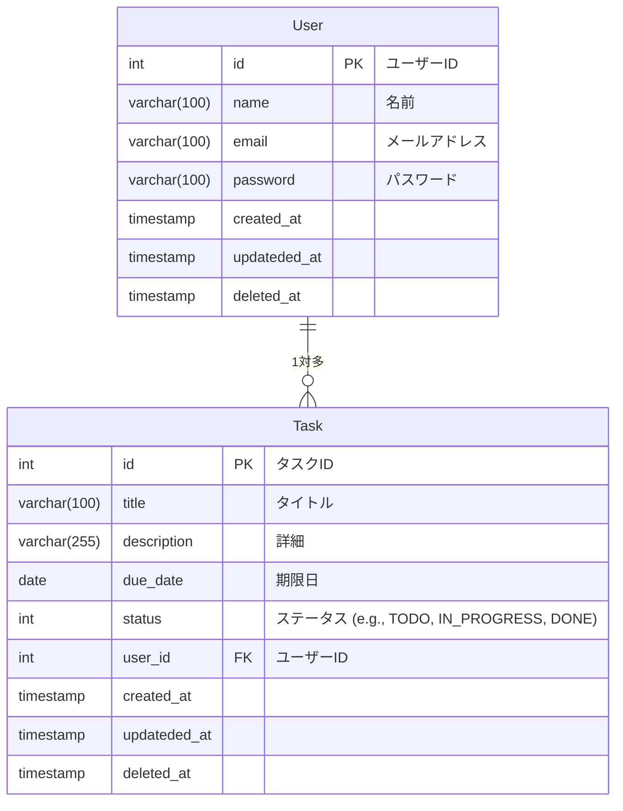
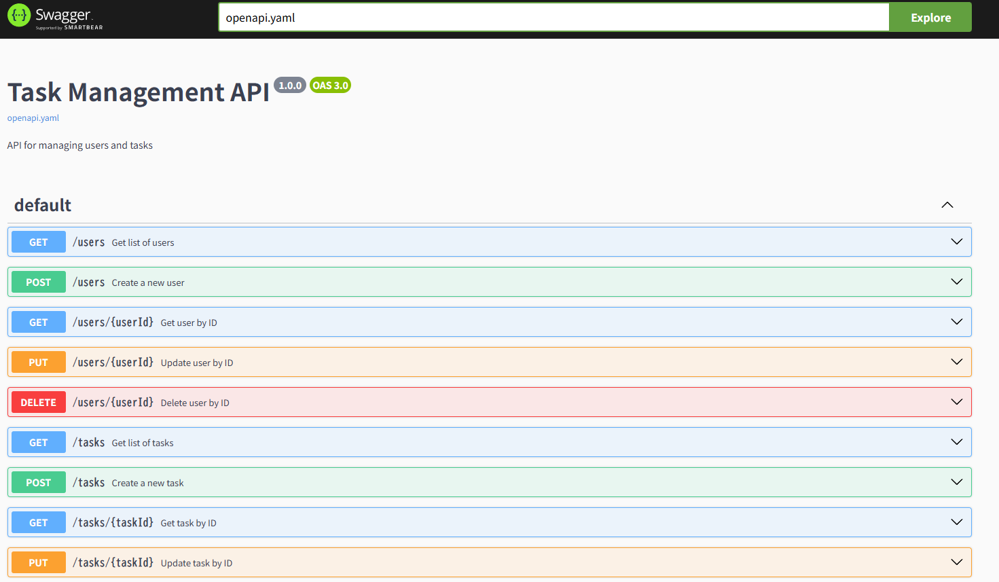

# OpenAPI の使い方

### ER 図



## ローカルで Swagger UI を使う（Node.js 環境）

### スクリーンショット



### 構成

```
/swagger-ui/dist/
  ├── index.html（公式から取得）
  ├── swagger-initializer.js（YAMLパスを指定）
  ├── openapi.yaml
  └── components
        ├── task.yaml
        └── user.yaml
```

### 準備

- swagger-ui を clone

```
git clone https://github.com/swagger-api/swagger-ui.git

# 作成した openapi.yaml をこの dist/ フォルダにコピー
cp /path/to/openapi.yaml ./openapi.yaml
```

- dist/swagger-initializer.js を編集

```
window.onload = function () {
  window.ui = SwaggerUIBundle({
    url: "openapi.yaml",  // ←ここにファイル名を指定
    dom_id: '#swagger-ui',
    presets: [
      SwaggerUIBundle.presets.apis,
      SwaggerUIStandalonePreset
    ],
    layout: "StandaloneLayout"
  });
};
```

```
npm install -g http-server
```

- 実行

```
cd swagger-ui/dist
http-server
```

- ブラウザで `http://127.0.0.1:8080/#/`を開く(キャッシュが残る可能性があるのでシークレットモードの方がいい)
