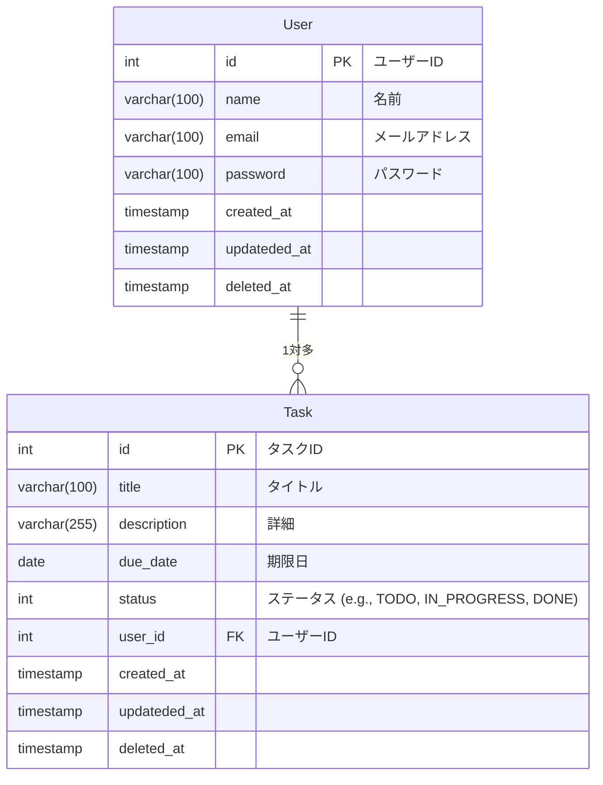

# OpenAPI の使い方

## ER 図

---

mermaid で記述する



## ローカルで Swagger UI を使う（Node.js 環境）

---

### スクリーンショット


### 構成

```
/swagger-ui/dist/
  ├── index.html（公式から取得）
  ├── swagger-initializer.js（YAMLパスを指定）
  ├── openapi.yaml
  └── components
        ├── task.yaml
        └── user.yaml
```

### 準備

- swagger-ui を clone

```
git clone https://github.com/swagger-api/swagger-ui.git

# 作成した openapi.yaml をこの dist/ フォルダにコピー
cp /path/to/openapi.yaml ./openapi.yaml
```

- dist/swagger-initializer.js を編集

```
window.onload = function () {
  window.ui = SwaggerUIBundle({
    url: "openapi.yaml",  // ←ここにファイル名を指定
    dom_id: '#swagger-ui',
    presets: [
      SwaggerUIBundle.presets.apis,
      SwaggerUIStandalonePreset
    ],
    layout: "StandaloneLayout"
  });
};
```

```
npm install -g http-server
```

### 実行

```
cd swagger-ui/dist
http-server
```

- ブラウザで `http://127.0.0.1:8080/#/`を開く(キャッシュが残る可能性があるのでシークレットモードの方がいい)

## Prism でモックサーバーを構築する

---

### Prism とは

Prism は、OpenAPI や AsyncAPI 仕様に基づいて、**モックサーバー、バリデーション、リクエスト転送**などを行うツールです。主に以下のような目的で使われます：

- API 設計段階でのモックサーバー提供（仕様駆動開発の支援）
- OpenAPI 仕様との整合性チェック（バリデーション）
- 実 API にリクエストをプロキシしながら仕様検証

### Prism の主な特徴

| 機能             | 内容                                                                   |
| ---------------- | ---------------------------------------------------------------------- |
| モックレスポンス | OpenAPI に基づいた JSON レスポンス生成（`examples`または`schema`から） |
| バリデーション   | リクエスト/レスポンスの OpenAPI 仕様準拠チェック                       |
| Proxy モード     | 実サーバーに転送して Prism で検証可能                                  |
| Watch モード     | OpenAPI ファイルの変更を監視してホットリロード可能                     |
| CLI 対応         | コマンドラインから簡単に操作でき、CI/CD とも親和性が高い               |

### ダミーデータの準備は必要？

- `example` や `examples` を定義しておくと、**指定された値でレスポンスを返します**（静的モック）。
- `schema` のみ定義した場合、Prism がスキーマに沿った**ランダムなダミーデータ**を生成します。

したがって、ダミーデータを自分で用意しなくても、OpenAPI のスキーマ記述だけでモックが成立します。

### 準備

```
# 準備
npm install -g @stoplight/prism-cli

# 実行
prism mock openapi.yaml
```

### 利用方法

- http://127.0.0.1:4010/pathに対してリクエストを送る

```
# get
curl -X GET http://127.0.0.1:4010/users/1
{"id":0,"name":"string","email":"string","password":"string","created_at":"2019-08-24T14:15:22Z","updateded_at":"2019-08-24T14:15:22Z","deleted_at":"2019-08-24T14:15:22Z"}

# list
$ curl -X GET http://127.0.0.1:4010/users
[{"id":0,"name":"string","email":"string","password":"string","created_at":"2019-08-24T14:15:22Z","updateded_at":"2019-08-24T14:15:22Z","deleted_at":"2019-08-24T14:15:22Z"}]
nanch@myPC MINGW64 ~/ws/simple-next-blog (20250415_2)

# post
$ curl -X POST http://localhost:4010/users \
  -H "Content-Type: application/json" \
  -d '{
    "name": "Alice",
    "email": "alice@example.com",
    "password": "securepassword123"
  }'
{"id":0,"name":"string","email":"string","password":"string","created_at":"2019-08-24T14:15:22Z","updateded_at":"2019-08-24T14:15:22Z","deleted_at":"2019-08-24T14:15:22Z"}

```
